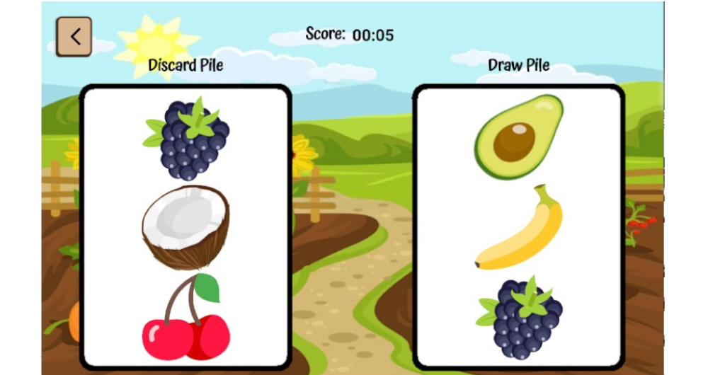
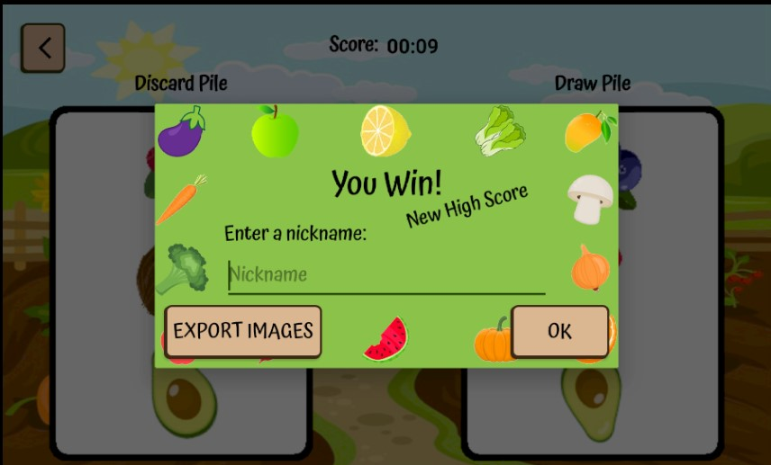
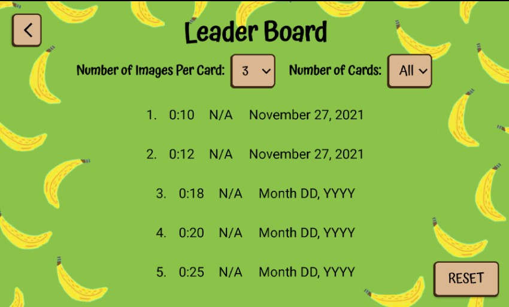

# FindIt
An Android app based on the card game Spot It. Players match images on cards and compete for high scores.

## Configurations
Minimum SDK Version: 24.0

Compatible Devices (reccommended): Pixel API 24, Pixel 2 API R

## Run
1. Download this repository and open the project folder in Android Studio
2. Create Config.java in "/project/findit/model", copy and paste in the following code, and fill in the Flickr `API_KEY`.
    ```Java
      package project.findit.model;

      public class Config {
          public static final String API_KEY = "";
      }
    ```
    1. If you don't want to use the Flickr API, leave `API_KEY` empty.
    2. To create a Flickr API key follow the steps listed [here](https://www.flickr.com/services/api/misc.api_keys.html)
2. Select a device
3. Run `SHIFT+F10`

## Game Play
Players are shown 2 cards at a time and have to find the image or word that matches on both cards.


Once the player has gone through all the cards, the game is over and the score is calculated based on how long it took to finish.


Players can compete for high score by solving the game faster.


## Settings
The settings can be changed within the __Options__ Page.

Settings include:
* Image Pack: Fruits/Vegetables/Flickr Images/Photo Gallery Images
  * Images displayed on the cards
* Number of Images Per Card: 3/4/6
* Number of Cards: **All/5/10/15/20
* Mode: Images/Words & Images
* Difficulty Mode: Easy/Normal/Hard
  * Easy: correct orientation, consistent size
  * Normal: random orientation, consistent size
  * Hard: random orientation, random size
* Sound Effects: On/Off

** options range depending on the number of images per card. (3 images: 7 cards, 4 images: 13 cards)
